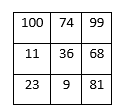

# TP 5 - Estructuras estáticas

### ENUNCIADO

#### Codifique en C los siguientes puntos

1-  Cree un vector de enteros de `5` posiciones, inicializándolo con los valores del `10`,`100`,`94`,`84`,`11`.

2- Cree un vector de `10` posiciones, pida al usuario que ingrese los `10` valores y luego muéstrelo de manera inversa.

3- Cree una matriz de enteros de `3x3`. Inicialícela en base a la siguiente tabla:

4- Cree un array de char y escriba la palabra “Bienvenidos”. Responda la siguiente pregunta:

`¿De cuantas posiciones deberá ser el vector?`

Rta: De 11 posiciones, tantas como lugares ocupe la palabra contenida.

5- Ingrese `10` valores en un vector de enteros. Sume todos los valores muestre el resultado en pantalla. Responda:

- ¿Cuántas líneas de código necesito para desarrollar el programa sin utilizar ciclos de repetición?

Rta: En principio ocupo 3 lineas de codigo para establecer ingresar los valores, sin ciclos de repeticion, necesitaria unos 30 de esas. La suma total, aunque desprolija, se puede hacer en una sola linea de codigo.

- Implemente la misma solución con ciclos de repetición, y responda ¿Cuántas líneas de código necesito en esta segunda versión?

Rta: Las intrucciones de ciclos de repeticion ocupacion 2 lineas adicionales, de comienzo y fin, pero ahorran la repetecion de tantas iteraciones como se necesiten, en este caso 10.

6- Desarrolle un programa que almacene en un vector el número de días que tiene cada mes (supondremos que es un año no bisiesto), pida al usuario que le indique un mes (`1=enero`, `12=diciembre`) y muestre en pantalla el número de días que tiene ese mes.

7- Desarrolle un programa que pida al usuario los datos de dos matrices de `2x2`, y calcule y muestre su producto. Investigue como obtener el producto de dos matrices.